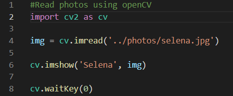
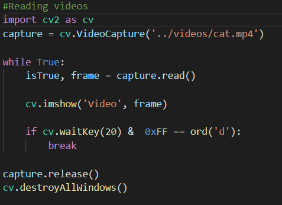
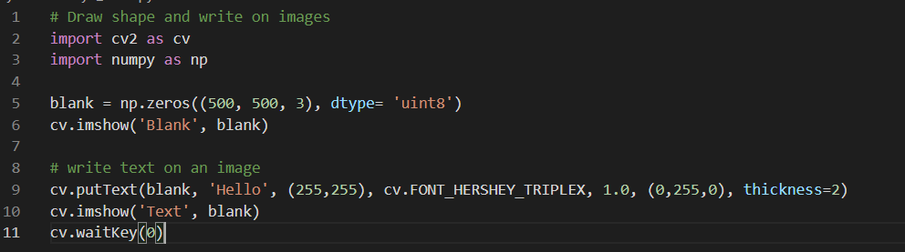

# Journey of 300 Days of Deep Learning for Computer Vision using Python

I am starting my journey in Computer Vision. I have started my journey by learning OpenCv from a youtube video uploaded by freeCodeCamp.org(the link is in the resources field) and I will be learning from a book written by Dr. Adrian Rosebrock called "Deep Learning For Computer Vision With Python". This repository will contain the things I have learnt on my journey to Computer Vision

|                       Books and Resources                      |
|----------------------------------------------------------------|
|1. [OpenCv](https://youtu.be/oXlwWbU8l2o)                       |
|2. Deep Learning For Computer Vision With Python: Starter Bundle|

**Day 1 of 300DaysOfDeepLearningForComputerVision!**
In Day1, I learned how to read and show photos and videos on screen using OpenCv. In addition to this I also learned how to rescale and resize image and video frames and draw shapes like rectangle, circle and straight line and write text on images.

