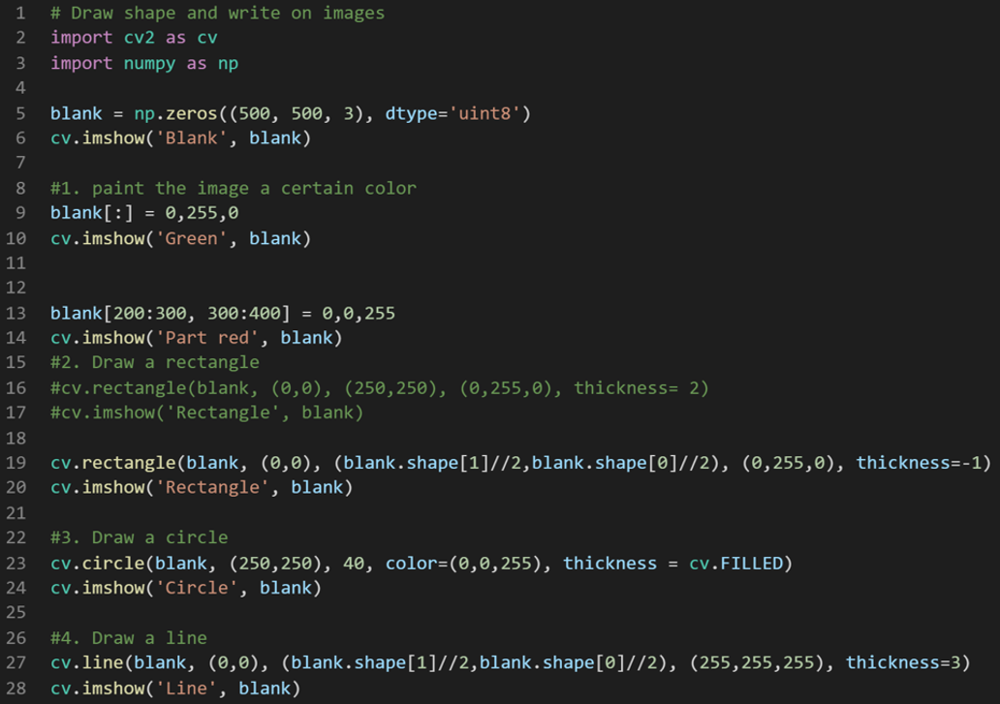

# Journey of 300 Days of Deep Learning for Computer Vision using Python

I am starting my journey in Computer Vision. I have started my journey by learning OpenCv from a youtube video uploaded by freeCodeCamp.org(the link is in the resources field) and I will be learning from a book written by Dr. Adrian Rosebrock called "Deep Learning For Computer Vision With Python". This repository will contain the things I have learnt on my journey to Computer Vision

|                       Books and Resources                      |
|----------------------------------------------------------------|
|1. [OpenCv](https://youtu.be/oXlwWbU8l2o)                       |
|2. Deep Learning For Computer Vision With Python: Starter Bundle|

### Day1 of 300DaysOfDeepLearningForComputerVision!
In Day1, I learned how to read and show photos and videos on screen using OpenCv. In addition to this I also learned how to rescale and resize image and video frames and draw shapes like rectangle, circle and straight line and write text on images.

### Day2 of 300DaysOfDeepLearningForComputerVision!
* **Basic Functions in OpenCv**
   - Converting to grayscale
   - Blur
   - Edge Cascade
   - Dilating the image
   - Eroding the dilated image
   - Resize
   - Crop

### Day3 of 300DaysOfDeepLearningForComputervision!
* **Image Transformation**
   - Translation
         Translation is basically shifting the image along the x and y axis. Using translation we can shift the image up, down, left, right or any combination of the above.
   - Rotation
         Rotation means rotating the image by some angle from an arbitary point.
   - Resize
         Resize means resizing the image i.e changing dimensions of the image. If we want to shrink the img, we use interpolation = cv.INTER_AREA and if we want to expand the image, we use
         interpolation = cv.INTER_CUBIC or cv.INTER_LINEAR. cv.INTER_CUBIC provides image with higher qualtity than cv.INTER_LINEAR and cv.INTER_AREA.
   - Flipping an image
         For flipping we use cv.flip functions which takes source image and flipcode as parameters. flipcode takes only 3 values i.e 0, 1, -1. flipcode = 0 implies flipping the image          vertically i.e. over the x-axis. 1 signifies flipping the image horizontally i.e. over the y-axis and -1 implies flipping the image both vertically and horizontally.
   - Crop
* **Contour Detection** 
     Contours are basically the boundaries of objects, the line or curve that joins the continuous points along the boundary of an object. From mathematical point of view, contours and
     edges are two different things. Contours are useful tools when you get into shape analysis and obbject detection and recognition. For contour detection, we use findCountours method          which returns two things:- countours and hierarchies and takes in the edges, a mode in which to find the contents and contour approximation. mode is either cv.RETR_TREE if you want all      the hierarchial contours  or cv.RETR_EXTERNAL if you want only the external contours or cv.RETR_List if you want all the contours in the image. Here, the returned counters is           essentially the python list of all the coordinates of contours that were found in the image and hierarchies refers to hierarchial representation of contours. 

### Day4 of 300DaysOfDeepLearningForComputerVision!
* **Color Spaces** 
      Color spaces are basically space of colors, a system of representing an array of pixel colors. RGB and grayscale are a kind of color space. There are other color spaces like HSV             and many more. Grayscale basically shows the distribution of pixel intensities at particular locations of your image. HSV is also called hue saturation value and is kind of based            on how human think and conceive of color. In openCv, we can convert BGR image to HSV, LAB, grayscale, RGB, etc and HSV, LAB, grayscale, RGB to BGR but we cannot directly convert             HSV to LAB or other color space except BGR and vice versa. We can do this by converting HSV to BGR and then BGR to the desired color space.
* **Split and Merge Color Channels**  
      A color image basically consists of a number of color channels: red, green and blue. All the images we see around us, all the BGR or RGB images, are basically thes three color       channels merged together. OpenCv allows us to split an image into its respective color channels. So we can take a BGR image and split it into blue, green and red components.

### Day5 of 300DaysOfDeepLearningForComputerVision!
* **Smoothing** 
       Smoothing is used to reduce noise like noise produced by camera sensor or to produce less pixelated image. We smooth out the image or reduce noise by applying some of the blurring           techniques.  
* **Blurrring Techniques** 
       - Average Blur
       - Gaussian Blur
       - Median Blur
       - Bilateral Blurring
* **Bitwise Operators** 
       There are four basic bitwise operators (AND, OR, NOT, XOR). They are used a lot in image processing especially when working with masks. Bitwise operators operate in a binary manner.

 

        

